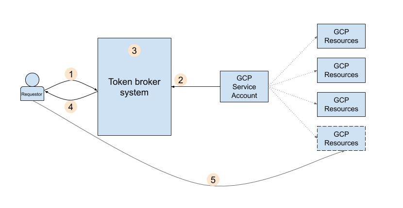

## Using Credential Access Boundary (DownScoped) Tokens

`Credential Access Boundary` is a policy language that you can use to downscope the accessing power of your GCP short-lived credentials. You can define a Credential Access Boundary that specifies which resources the short-lived credential can access, as well as an upper bound on the permissions that are available on each resource

For example, if the parent Credential that represents user Alice has Read/Write access to GCS buckets `A`, `B`, `C`, you can exchange the Alice's credential for another credential that still identifies Alice but can only be used for Read against Bucket `A` and `C`.   You can also define an expression based on a partial resource path and prefix (eg, downscope a token with permissions on a specific object in GCS or a path within GCS) 


DownScoped tokens are normally used in a tokenbroker/exchange service where you can mint a new restricted token to hand to a client. The sample usage and implementations below shows how to generate a downscoped token, extract the raw access_token, and
 then inject the raw token in another TokenSource.

** NOTE:**

* DownScoped tokens currently only works for GCS buckets and cannot be applied yet at the bucket+prefix or object level.
* The GCS bucket must be enabled with [Uniform bucket-level access](https://cloud.google.com/storage/docs/uniform-bucket-level-access
* Supported credentials: The only supported type of credential in Credential Access Boundary is OAuth2.0 access token.


>> >>> **IMPORTANT**  If you are just looking for code samples that generate downscoped tokens, just use the official samples here [https://cloud.google.com/iam/docs/downscoping-short-lived-credentials#exchange-credential-auto](https://cloud.google.com/iam/docs/downscoping-short-lived-credentials#exchange-credential-auto)


### Defining a boundary rule:

You downscope a token by transmitting that token to a google token endpoint along with a boundary rule describing the resources and roles the credential should be restricted to.

The definition of a boundary rule is just json:

```json
{
  "accessBoundaryRules": [
    {
      "availableResource": "string",
      "availablePermissions": [
        "list"
      ],
      "availabilityCondition": {
        "title": "string",
        "expression": "string"
      }
    }
  ]
}
```

where

* `AvailableResource` (required)
This is the GCP resource (such as organization, folder, project, bucket, etc) to which access may be allowed (and allowed to resources below that resource if applicable). It must be in the format of a GCP Resource Name.


* `AvailablePermissions` (required)
This is a list of permissions that may be allowed for use on the specified resource or resources below the specified resource. The only supported value is IAM role with syntax: "inRole:roles/storage.admin"

* `AvailabilityCondition` (optional)
This describes additional fine-grained constraints to apply to the token.  The `expression` parameter describes the resource condition this rule applies to in [CEL Format](https://cloud.google.com/iam/docs/conditions-overview#cel). 

As an example, the following would the token to just `objectViewer` on `BUCKET_2` and specifically an object (prefix) `/foo.txt`

```json
{
  "accessBoundary" : {
      "accessBoundaryRules" : [
        {
          "availableResource" : "//storage.googleapis.com/projects/_/buckets/$BUCKET_2",
          "availablePermissions": ["inRole:roles/storage.objectViewer"],
          "availabilityCondition" : {
            "title" : "obj-prefixes",
            "expression" : "resource.name.startsWith(\"projects/_/buckets/$BUCKET_2/objects/foo.txt\")"
          }
        }
      ]
  }
}
```

* `AvailabilityConditions` (optional)
This defines restrictions on the resource based on a condition such as the path or prefix within that path.  Use an `availabilityCondition` to define such things as a specific object this downscoped token could access or the path prefix the token has permissions on.

### Exchange the token

You now need to transmit the original `access_token` and the boundary rule to a google token-exchange endpoint: `https://securetoken.googleapis.com/v2beta1/token`.  The response JSON will return a new token if the policy file is well formed.  


### Usage: curl

As a quick demonstration of this capability, create two GCS buckets and acquire an `access_token` that you can use to list objects in either bucket.   Exchange that `access_token` for another `access_token` that _can only be used_ on one of the two buckets:

1. Create two buckets:

```bash
export PROJECT_ID=`gcloud config get-value core/project`

export BUCKET_1=$PROJECT_ID-1
export BUCKET_2=$PROJECT_ID-1-suffix

gsutil mb gs://$BUCKET_1
gsutil mb gs://$BUCKET_2
echo "foo" > someobject.txt
gsutil cp someobject.txt gs://$BUCKET_2/
```

2. Create policy to only allow `storage.objectViewer` to `BUCKET_2` AND on object `/foo.txt`

```
cat <<EOF > access_boundary_2.json
{
  "accessBoundary" : {
      "accessBoundaryRules" : [
        {
          "availableResource" : "//storage.googleapis.com/projects/_/buckets/$BUCKET_2",
          "availablePermissions": ["inRole:roles/storage.objectViewer"],
          "availabilityCondition" : {
            "title" : "obj-prefixes",
            "expression" : "resource.name.startsWith(\"projects/_/buckets/$BUCKET_2/objects/foo.txt\")"
          }
        }
      ]
  }
}

EOF
```

3. Get existing `access_token`

```
export TOKEN=`gcloud auth application-default print-access-token`
```

4. Exchange `access_token`

(the following command uses [jq](https://stedolan.github.io/jq/download/) to parse the response):

```bash
NEW_TOKEN_1=`curl -s -H "Content-Type:application/x-www-form-urlencoded" -X POST https://securetoken.googleapis.com/v2beta1/token -d 'grant_type=urn:ietf:params:oauth:grant-type:token-exchange&subject_token_type=urn:ietf:params:oauth:token-type:access_token&requested_token_type=urn:ietf:params:oauth:token-type:access_token&subject_token='$TOKEN --data-urlencode "options=$(cat access_boundary_1.json)" | jq -r '.access_token'`
```

5. Use downscoped token

Try listing bucket contents using the new token...

as you'll see, you can access `BUCKET_2` but not `BUCKET_1` since we're using the downscoped token
```bash
curl -s -H "Authorization: Bearer $NEW_TOKEN_1"  -o /dev/null  -w "%{http_code}\n" https://storage.googleapis.com/storage/v1/b/$BUCKET_1/o

curl -s -H "Authorization: Bearer $NEW_TOKEN_1"  -o /dev/null  -w "%{http_code}\n" https://storage.googleapis.com/storage/v1/b/$BUCKET_2/o
```

### Implementations


>>> **IMPORTANT**  Just use the official samples here [https://cloud.google.com/iam/docs/downscoping-short-lived-credentials#exchange-credential-auto](https://cloud.google.com/iam/docs/downscoping-short-lived-credentials#exchange-credential-auto)

At the moment, no official `google-auth-*` library supports this capability.  However, i've written up the implementations in the following languages which behave as if its just another credential type for any google cloud client libraries (well..just GCS at the moment).

- `golang`:  Use as `github.com/salrashid123/oauth2/google/DownScopedTokenSource`
- `java`:  Use as `com/google/auth/oauth2/DownScopedCredentials`
- `python`: Use as `google/auth/downscoped_credentials`

#### golang: [github.com/salrashid123/oauth2/google DownScopedTokenSource](https://github.com/salrashid123/oauth2#usage-downscoped)

  For example:

```golang
package main

import (
	"context"
	"io/ioutil"
	"log"

	"cloud.google.com/go/storage"
	sal "github.com/salrashid123/oauth2/google"
	"google.golang.org/api/iterator"
	"google.golang.org/api/option"

	"golang.org/x/oauth2/google"
)

const (
	serviceAccountFile = "/path/to/svc_account.json"
)

var (
	projectID  = "yourproject"
	bucketName = "yourbucket"
	folder     = ""
)

func main() {

	ctx := context.Background()

	// rootTokenSource, err := google.DefaultTokenSource(ctx, "https://www.googleapis.com/auth/cloud-platform")
	// if err != nil {
	// 	log.Fatal(err)
	// }

	data, err := ioutil.ReadFile(serviceAccountFile)
	if err != nil {
		log.Fatal(err)
	}

	creds, err := google.CredentialsFromJSON(ctx, data, "https://www.googleapis.com/auth/cloud-platform")
	if err != nil {
		log.Fatal(err)
	}
	rootTokenSource := creds.TokenSource

	downScopedTokenSource, err := sal.DownScopedTokenSource(
		&sal.DownScopedTokenConfig{
			RootTokenSource: rootTokenSource,
			DownscopedOptions: sal.DownscopedOptions{
				AccessBoundary: sal.AccessBoundary{
					AccessBoundaryRules: []sal.AccessBoundaryRule{
						sal.AccessBoundaryRule{
							AvailableResource: "//storage.googleapis.com/projects/_/buckets/" + bucketName,
							AvailablePermissions: []string{
								"inRole:roles/storage.objectViewer",
							},
							AvailabilityCondition: sal.AvailabilityCondition{
								Title:      "obj-prefixes",
								Expression: "resource.name.startsWith(\"projects/_/buckets/your_bucket/objects/foo.txt\")",
							},
						},
					},
				},
			},
		},
	)

	// Normally, you give the token back directly to a client to use
	// In the following tok.AccessToken is applied to a non-refreshable StaticTokenSource
	// which can be used with the storageClient
	//
	// tok, err := downScopedTokenSource.Token()
	// if err != nil {
	// 	log.Fatal(err)
	// }
	// log.Printf("Downscoped Token: %v\n", tok.AccessToken)
	// sts := oauth2.StaticTokenSource(tok)

	// To use directly in a client

	// client := &http.Client{
	// 	Transport: &oauth2.Transport{
	// 		Source: sts,
	// 	},
	// }

	// url := fmt.Sprintf("https://storage.googleapis.com/storage/v1/b/%s/o", bucketName)
	// resp, err := client.Get(url)
	// if err != nil {
	// 	log.Fatal(err)
	// }
	// log.Printf("Response: %v", resp.Status)

	// or with google-cloud library

	storageClient, err := storage.NewClient(ctx, option.WithTokenSource(downScopedTokenSource))
	if err != nil {
		log.Fatalf("Could not create storage Client: %v", err)
	}

	it := storageClient.Bucket(bucketName).Objects(ctx, &storage.Query{
		Prefix: folder,
	})
	for {

		attrs, err := it.Next()
		if err == iterator.Done {
			break
		}
		if err != nil {
			log.Fatal(err)
		}
		log.Println(attrs.Name)
	}

}
```

#### Java

see `java/src/main/java/com/google/auth/oauth2/DownScopedCredentials.java`


```java
package com.test;

import com.google.api.gax.paging.Page;
import com.google.auth.oauth2.DownScopedCredentials;
import com.google.auth.oauth2.GoogleCredentials;
import com.google.auth.oauth2.ServiceAccountCredentials;
import com.google.auth.oauth2.DownScopedCredentials.DownScopedOptions;
import com.google.cloud.ServiceOptions;
import com.google.cloud.storage.Blob;
import com.google.cloud.storage.Storage;
import com.google.cloud.storage.StorageOptions;

public class TestApp {
     public static void main(String[] args) {
          try {
               TestApp tc = new TestApp();
          } catch (Exception ex) {
               System.out.println(ex);
          }
     }

     public TestApp() throws Exception {
          try {

               String bucketName = "your_bucket";
               String keyFile = "/path/to/svc_account.json";

               String projectId = ServiceOptions.getDefaultProjectId();
               System.out.println(projectId);

               GoogleCredentials sourceCredentials;

               // File credentialsPath = new File(keyFile);
               // try (FileInputStream serviceAccountStream = new FileInputStream(credentialsPath)) {
               //      sourceCredentials = ServiceAccountCredentials.fromStream(serviceAccountStream);
               // }
               // if (sourceCredentials.createScopedRequired())
               //      sourceCredentials = sourceCredentials
               //                .createScoped("https://www.googleapis.com/auth/cloud-platform");

               sourceCredentials = GoogleCredentials.getApplicationDefault();

               DownScopedCredentials.AvailabilityCondition ap = new DownScopedCredentials.AvailabilityCondition();
               ap.setTitle("obj");
               ap.setExpression("resource.name.startsWith(\"projects/_/buckets/" + bucketName + "/objects/foo.txt\")");

               DownScopedCredentials.AccessBoundaryRule abr = new DownScopedCredentials.AccessBoundaryRule();
               abr.setAvailableResource("//storage.googleapis.com/projects/_/buckets/" + bucketName);
               abr.addAvailablePermission("inRole:roles/storage.objectViewer");
               abr.setAvailabilityCondition(ap);

               DownScopedCredentials.AccessBoundary ab = new DownScopedCredentials.AccessBoundary();
               ab.setAccessBoundaryRules(abr);

               DownScopedOptions dopt = new DownScopedOptions();
               dopt.setAccessBoundary(ab);
   
               DownScopedCredentials dc = DownScopedCredentials.create(sourceCredentials, dopt);

               // Normally, you give the token back directly to a client to use
               // In the following, the AccessToken's value is used to generate a new
               // GoogleCredential object at the client:
               // AccessToken tok = dc.refreshAccessToken();
               // System.out.println(tok.getTokenValue());
               // GoogleCredentials sts = GoogleCredentials.create(tok);

               Storage storage = StorageOptions.newBuilder().setCredentials(dc).build().getService();
               Blob blob = storage.get(bucketName, "foo.txt");
               String fileContent = new String(blob.getContent());

               System.out.println(fileContent);


          } catch (Exception ex) {
               System.out.println("Error:  " + ex.getMessage());
          }
     }

}
```

#### Python

see `python/google/auth/downscoped_credentials.py`

```
virtualenv env
source env/bin/activate
pip install google-cloud-storage
cp google/auth/downscoped_credentials.py env/lib/python3.7/site-packages/google/auth/
```

```python
import google.auth
from google.oauth2 import service_account
from google.cloud import storage

from google.auth import downscoped_credentials

bucket_name = "your_bucket"

svcAccountFile = "/path/to/svc_account.json"
target_scopes = [
    'https://www.googleapis.com/auth/devstorage.read_only']

source_credentials = (
    service_account.Credentials.from_service_account_file(
        svcAccountFile,
        scopes=target_scopes))

downscoped_options = {
  "accessBoundary" : {
      "accessBoundaryRules" : [
        {
          "availableResource" : "//storage.googleapis.com/projects/_/buckets/" + bucket_name,
          "availablePermissions": ["inRole:roles/storage.objectViewer"],
          "availabilityCondition" : {
            "title" : "obj-prefixes",
            "expression" : "resource.name.startsWith(\"projects/_/buckets/" + bucket_name + "/objects/foo.txt\")"
          }
        }
      ]
  }
}


# or use default credentials
source_credentials, project_id = google.auth.default()

dc = downscoped_credentials.Credentials(source_credentials=source_credentials,downscoped_options=downscoped_options)

storage_client = storage.Client(credentials=dc)
bucket = storage_client.bucket(bucket_name)
blob = bucket.blob("foo.txt")
print(blob.download_as_string())
```


You don't have to use any of those libraries ofcourse!.  If you manually exchange and acquire a downscoped token, you can 'just apply' it to several existing `google-auth-*` constructs that allows you to set the token:

* golang: [oauth2.StaticTokenSource](https://godoc.org/golang.org/x/oauth2#StaticTokenSource)
* python: [google.auth.credentials.Credentials.apply](https://google-auth.readthedocs.io/en/latest/reference/google.auth.credentials.html#google.auth.credentials.Credentials.apply)
* java: [com.google.auth.oauth2.GoogleCredentials.create()](https://googleapis.dev/java/google-auth-library/latest/com/google/auth/oauth2/GoogleCredentials.html#create-com.google.auth.oauth2.AccessToken-)

Note, if you use these, the static `access_token` will not get refreshed automatically.  

### Usecase: TokenBroker

1. A developer or workload (the requester) requests credentials to get access to certain GCP resources.
2. The broker system identifies the service account that has access to the requested resources and gets a credential for that service account.
3. Before handing off the credentials to the requestor, the broker system restricts the permissions on the credential to only what the token requester needs access to, by applying a `Credential Access Boundary` on the service account credentials by calling the CAB API.
4. The broker system hands the downscoped credentials to the requester.
5. The requester can now use those credentials to access GCP resources

This release has the following restrictions:




---


Thats it...this is just an alpha capability...do not use this in production yet!.  Again, the intent of this article is to get feedback...please add in any comments to the repo here [https://github.com/salrashid123/downscoped_token](https://github.com/salrashid123/downscoped_token):
